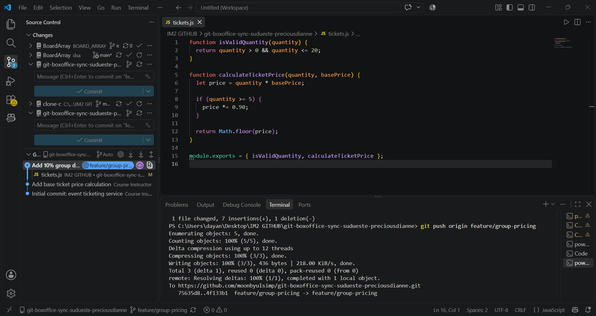
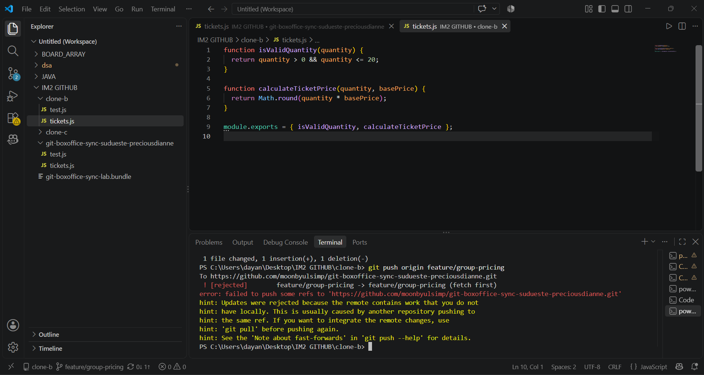
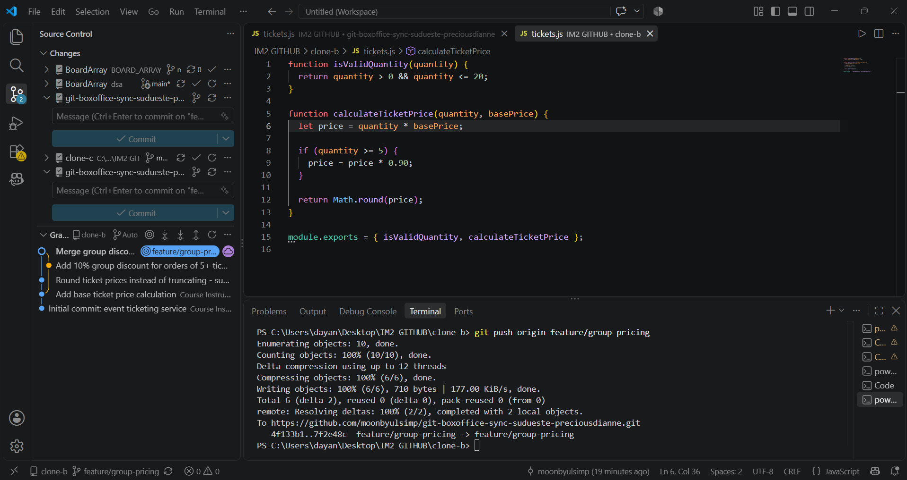
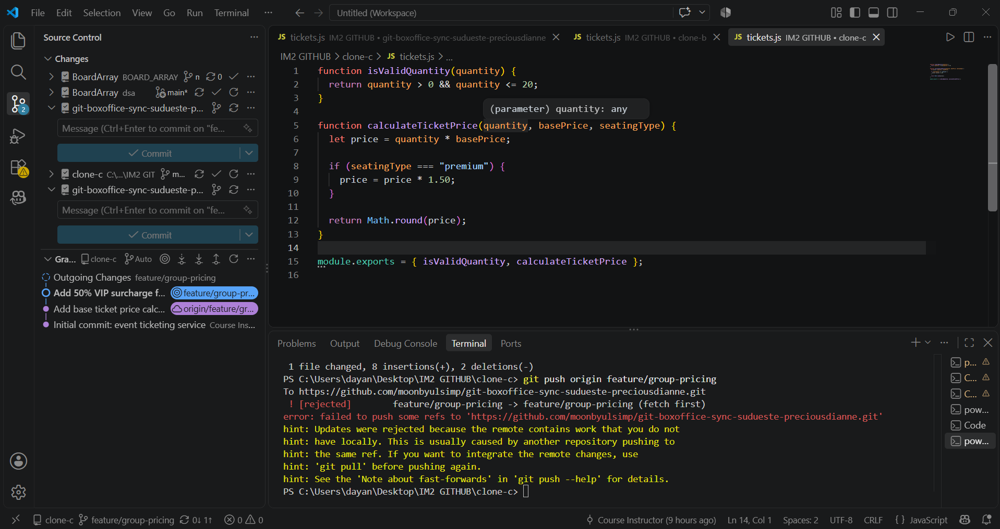
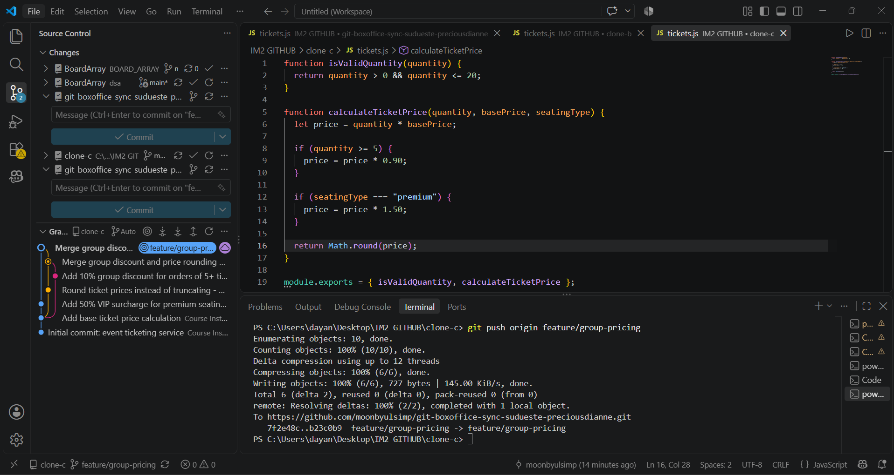
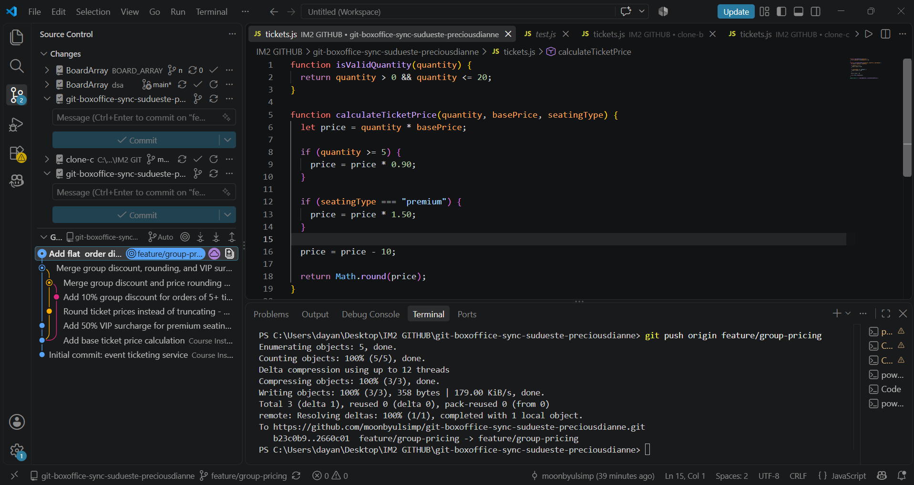
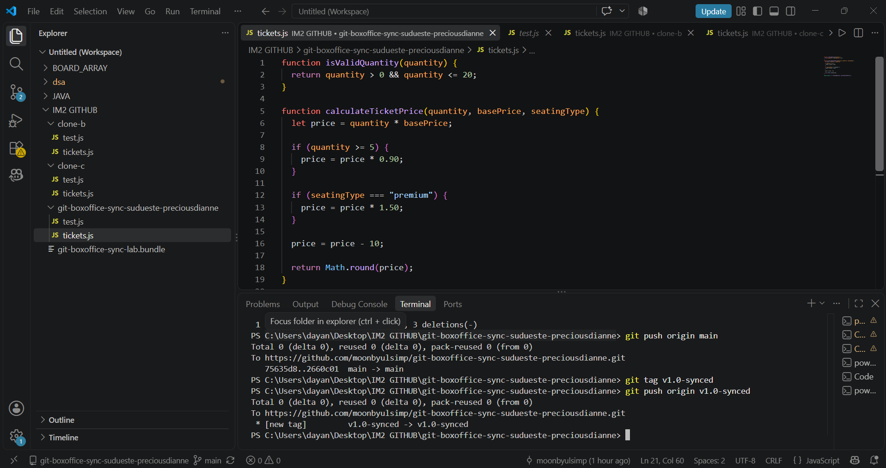

# WORKFLOW.md

## Task 1 — Group discount pushed from Clone A

## Task 2 — Diverging change in Clone B, rejected

## Task 3 — Merge resolution in Clone B

## Task 4 — VIP surcharge in Clone C, rejected

## Task 5 — Three-way merge resolution in Clone C

## Task 6 — Flat discount rejected, resolved via rebase

## Task 7 — Merged to main, tagged v1.0-synced

---

## Questions

### 1. Walk through the final calculateTicketPrice function and name which contributor's change is responsible for each part.
The final calculateTicketPrice function combines the work of all three contributors. let price = quantity * basePrice; comes from the original starter code and calculates the base ticket price. The if (quantity >= 5) { price = price * 0.90; } condition with the 10% discount was added by Contributor A (Clone A) in Task 1. The if (seatingType === "premium") condition with the 50% VIP surcharge was added by Contributor C (Clone C) in Task 4/5. The price = price - 10 line was added later by Contributor A in Task 6 and applies a flat $10 discount to every order. Finally, return Math.round(price); was added by Contributor B (Clone B) in Task 2, changing the original Math.floor behavior to normal rounding. The final function therefore combines all of these changes instead of allowing one contributor's work to overwrite another's.

### 2. Compare Task 3's two-way conflict to Task 5's three-way conflict — what got harder with a third line of work?
Task 3 involved two contributors changing the same part of the function, mainly the group discount and rounding behavior. The conflict required deciding how to keep both changes without removing either contributor's work. Task 5 was more difficult because a third contributor introduced another change while working from an older version of the repository. With three lines of development, I had to consider the group discount, rounding, and VIP surcharge together and determine the correct order of the calculations. It also became easier to accidentally delete or overwrite an earlier change, so I had to understand what each contributor intended and combine the changes manually.

### 3. Task 6's flat $10 discount changed the expected result of tests unrelated to your change (the group-discount and VIP tests). Why, and what does that tell you about "isolated" changes in shared code?
The flat $10 discount changed the results because price = price - 10 is not inside a condition, so it runs every time calculateTicketPrice is called. Even tests that were specifically checking the group discount or VIP surcharge use the same shared function, so the additional $10 deduction affected their final results. This shows that a change is not necessarily isolated just because it targets a different feature. When multiple features depend on the same shared function, even a small change can affect other features and their tests. This is why all related tests should be rerun after modifying shared code.

### 4. If this were a real team of three, what one process change would have prevented all three rejected pushes?
A shared synchronization process would have prevented the rejected pushes. Before starting new work, each contributor should git pull or git fetch to make sure their branch is based on the latest remote version. All three rejections happened because each person started editing based on an old version of the branch without checking if someone already pushed changes. Contributors should also communicate which files or functions they are changing. By synchronizing before starting work instead of only before pushing, conflicts could be discovered earlier and handled one at a time rather than having multiple contributors work from outdated versions of the code.